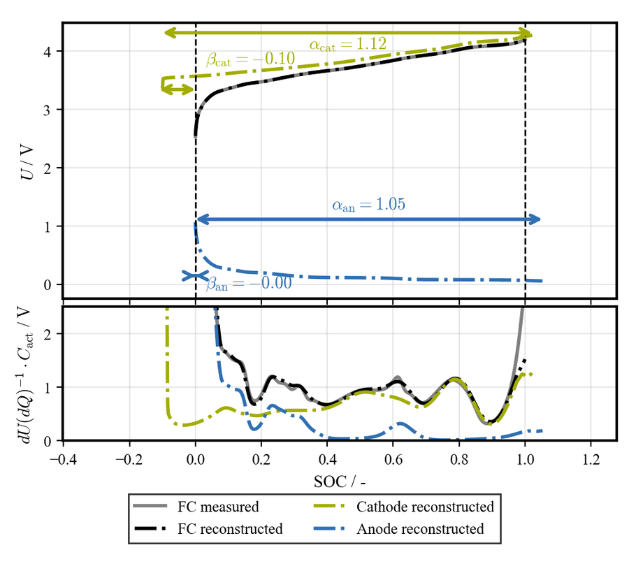

# PyDMA - Battery Degradation Mode Analysis

<div align="center">

**Python implementation of TUM-EES DegradationModeAnalysis framework**

<!-- PyPI badge -->
<a href="https://pypi.org/project/pydma/">
  
</a>

<!-- environment and language -->
<a href="https://www.python.org/">
  
</a>

<!-- license badge -->
<a href="https://opensource.org/licenses/BSD-3-Clause">
  
</a>

<!-- paper badges -->
<a href="https://doi.org/10.1016/j.jpowsour.2026.239418">
  
</a>

<a href="https://doi.org/10.1039/D5EB00221D">
  
</a>

<br>



</div>

## 🔭 Overview

PyDMA is a Python package for performing degradation mode analysis of lithium-ion and sodium-ion batteries. Among others, both electrodes can be modeled as blends, and inhomogeneity is available for both electrodes. It reconstructs measured pseudo-OCV curves using half-cell electrode potential curves to quantify three degradation mechanisms:

- **LLI**: Loss of lithium inventory (charge carrier loss)
- **LAM_an**: Loss of active material at anode
- **LAM_ca**: Loss of active material at cathode

The core algorithm reconstructs full-cell OCV as:

```
OCV_cell(SOC) = U_cathode(α_ca · SOC + β_ca) - U_anode(α_an · SOC + β_an)
```

Where α scales capacity and β shifts the SOC window.

## ⚙️ Installation

Install from PyPI:

```bash
pip install pydma
```

Or install from source:

```bash
git clone https://github.com/tum-ees/pydma.git
cd pydma
pip install .
```

For development installation:

```bash
git clone https://github.com/tum-ees/pydma.git
cd pydma
pip install -e ".[dev,notebook]"
```

## 🎮 Quick Start

```python
import pydma
from pydma import DMAAnalyzer, DMAConfig

# Load your electrode OCP data
anode_ocp = pydma.load_ocp("path/to/anode_ocp.csv")
cathode_ocp = pydma.load_ocp("path/to/cathode_ocp.csv")

# Create analyzer with configuration
config = DMAConfig(
    direction="charge",
    weight_ocv=100,
    weight_dva=1,
    weight_ica=0,
)

analyzer = DMAAnalyzer(
    anode_ocp=anode_ocp,
    cathode_ocp=cathode_ocp,
    config=config,
)

# Run analysis on aging study data
results = analyzer.analyze_aging_study(
    pocv_data={"CU1": pocv_cu1, "CU2": pocv_cu2, ...},
)

# Access degradation modes
print(f"LLI: {results.lam_results['CU2'].lli:.2%}")
print(f"LAM_an: {results.lam_results['CU2'].lam_anode:.2%}")
print(f"LAM_ca: {results.lam_results['CU2'].lam_cathode:.2%}")

# Plot results
results.plot_degradation_modes()
```

## 📖 Key Features

### Blend Electrode Model

Supports blended electrodes (e.g., Silicon-Graphite anodes):

```python
config = DMAConfig(
    use_anode_blend=True,
    gamma_anode_blend2_upper=0.30,  # Max 30% silicon
)

analyzer = DMAAnalyzer(
    anode_blend1_ocp=graphite_ocp,  # Primary: Graphite
    anode_blend2_ocp=silicon_ocp,    # Secondary: Silicon
    cathode_ocp=cathode_ocp,
    config=config,
)
```

### Inhomogeneity Modeling

Models electrode inhomogeneity effects:

```python
config = DMAConfig(
    allow_anode_inhomogeneity=True,
    allow_cathode_inhomogeneity=True,
    max_inhomogeneity=0.3,
)
```

### Multiple Fitting Objectives

Combine OCV, DVA, and ICA fitting with custom weights:

```python
config = DMAConfig(
    weight_ocv=100,
    weight_dva=1,
    weight_ica=0,
    roi_dva_min=0.1,
    roi_dva_max=0.9,
)
```

### Speed Presets

Choose optimization thoroughness:

```python
config = DMAConfig(speed_preset="thorough")  # "fast", "medium", or "thorough"
```

## 🔧 Silicon OCP Generation

Generate silicon OCP from measured blend electrode data:

```python
from pydma.silicon import generate_silicon_curve

silicon_ocp = generate_silicon_curve(
    blend_ocp=measured_blend_ocp,
    graphite_ocp=graphite_reference,
    gamma_si=0.245,
    direction="lithiation",
)
```

## 📊 Parameter Vector Layout

The optimizer uses an 8-element parameter vector internally:

| Index | Parameter | Description |
|-------|-----------|-------------|
| 0 | α_an | Anode scaling / capacity ratio |
| 1 | β_an | Anode offset / SOC shift |
| 2 | α_ca | Cathode scaling |
| 3 | β_ca | Cathode offset |
| 4 | γ_blend2_an | Anode blend2 fraction (0 if disabled) |
| 5 | γ_blend2_ca | Cathode blend2 fraction (0 if disabled) |
| 6 | σ_an | Anode inhomogeneity magnitude |
| 7 | σ_ca | Cathode inhomogeneity magnitude |

## 📚 Documentation

See the [Getting Started Notebook](notebooks/getting_started.ipynb) for detailed examples.

## 🎖️ Acknowledgments

This is a Python translation of the [TUM-EES DegradationModeAnalysis](https://github.com/tum-ees/degradation-mode-analysis) MATLAB framework.
We would like to thank Johannes Natterer for providing the aging data set of a cyclic aged P45B cell and for help in translating into Python.

## 📯 Developers

- [Mathias Rehm](mailto:mathias.rehm@tum.de), Chair of Electrical Energy Storage Technology, School of Engineering and Design, Technical University of Munich, 80333 Munich, Germany
- [Josef Eizenhammer](mailto:josef.eizenhammer@tum.de), Chair of Electrical Energy Storage Technology, School of Engineering and Design, Technical University of Munich, 80333 Munich, Germany
- Moritz Günthner (student research project)
- Can Korkmaz (student research project)

## ✒️ Citation

This framework is the Python implementation of the MATLAB DegradationModeAnalysis toolbox.
If you use this repository in any publication, please cite:

> M. Rehm et al., "How to determine the degradation modes of lithium-ion batteries with silicon–graphite blend electrodes,"
> *Journal of Power Sources*, 2026, DOI: [10.1016/j.jpowsour.2026.239418](https://doi.org/10.1016/j.jpowsour.2026.239418)

The framework is also applied and validated on commercial sodium-ion batteries in the following publication.
We appreciate citing this work as well, and kindly ask you to do so if your work involves sodium-ion cells:

> M. Rehm et al., "Aging of commercial sodium-ion batteries with layered oxides: how to measure and analyze it?,"
> *EES Batteries*, 2026, DOI: [10.1039/D5EB00221D](https://doi.org/10.1039/D5EB00221D)

## 📜 License

BSD 3-Clause "New" or "Revised" License - see [LICENSE](LICENSE) for details.
