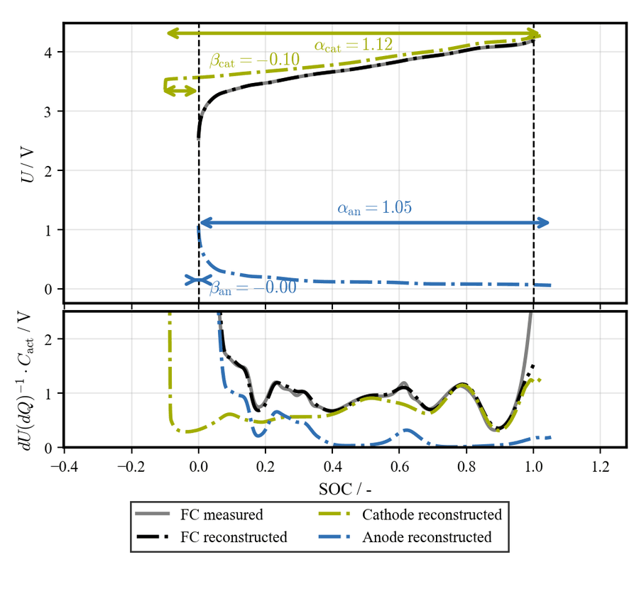

# PyDMA - Battery Degradation Mode Analysis

<div align="center">

**Python implementation of TUM-EES DegradationModeAnalysis framework**

<!-- PyPI badge -->
<a href="https://pypi.org/project/pydma/">
  
</a>

<!-- permanent software archive -->
<a href="https://doi.org/10.5281/zenodo.21346639">
  
</a>

<!-- environment and language -->
<a href="https://www.python.org/">
  
</a>

<!-- license badge -->
<a href="https://opensource.org/licenses/BSD-3-Clause">
  
</a>

<!-- paper badges -->
<a href="https://doi.org/10.1016/j.jpowsour.2026.239418">
  
</a>

<a href="https://doi.org/10.1039/D5EB00221D">
  
</a>

<br>



</div>

## 🔭 Overview

PyDMA is a Python package for performing degradation mode analysis of lithium-ion and sodium-ion batteries. Among others, both electrodes can be modeled as blends, and inhomogeneity is available for both electrodes. It reconstructs measured pseudo-OCV curves using half-cell electrode potential curves to quantify three degradation mechanisms:

- **LLI**: Loss of lithium inventory (charge carrier loss)
- **LAM_an**: Loss of active material at anode
- **LAM_ca**: Loss of active material at cathode

The core algorithm reconstructs full-cell OCV as:

```
OCV_cell(SOC) = U_cathode(α_ca · SOC + β_ca) - U_anode(α_an · SOC + β_an)
```

Where α scales capacity and β shifts the SOC window.

## ⚙️ Installation

Install from PyPI:

```bash
pip install pydma
```

Or install from source:

```bash
git clone https://github.com/tum-ees/pydma.git
cd pydma
pip install .
```

For development installation:

```bash
git clone https://github.com/tum-ees/pydma.git
cd pydma
pip install -e ".[dev,notebook]"
```

## 🎮 Quick Start

```python
import pydma
from pydma import DMAAnalyzer, DMAConfig

# Load your electrode OCP data
anode = pydma.load_ocp("path/to/anode_ocp.csv", electrode_type="anode")
cathode = pydma.load_ocp("path/to/cathode_ocp.csv", electrode_type="cathode")

# Create analyzer with configuration
config = DMAConfig(
    direction="charge",
    weight_ocv=100,
    weight_dva=1,
    weight_ica=0,
)

analyzer = DMAAnalyzer(
    config=config,
    anode=anode,
    cathode=cathode,
)

# Run analysis on aging study data
# The analyzer uses config.direction when loading the study.
results = analyzer.analyze_aging_study("path/to/aging_data")

# Access degradation modes
print(f"LLI: {results['CU2'].degradation_modes.lli:.2%}")
print(f"LAM_an: {results['CU2'].degradation_modes.lam_anode:.2%}")
print(f"LAM_ca: {results['CU2'].degradation_modes.lam_cathode:.2%}")

# Plot results
results.plot_degradation_modes()
```

## 📖 Key Features

### Blend Electrode Model

Supports blended electrodes (e.g., Silicon-Graphite anodes):

```python
from pydma import BlendElectrode

config = DMAConfig(
    use_anode_blend=True,
    gamma_anode_blend2_upper=0.30,  # Max 30% silicon
)

si_gr_anode = BlendElectrode(blend1=graphite_ocp, blend2=silicon_ocp)

analyzer = DMAAnalyzer(
    config=config,
    anode=si_gr_anode,
    cathode=cathode,
)
```

### Inhomogeneity Modeling

Models electrode inhomogeneity effects:

```python
config = DMAConfig(
    allow_anode_inhomogeneity=True,
    allow_cathode_inhomogeneity=True,
    max_inhomogeneity=0.3,
    inhom_anode_offset=0.2,
    inhom_cathode_offset=0.0,
)
```

### Multiple Fitting Objectives

Combine OCV, DVA, and ICA fitting with custom weights:

```python
config = DMAConfig(
    weight_ocv=100,
    weight_dva=1,
    weight_ica=0,
    roi_dva_min=0.1,
    roi_dva_max=0.9,
)
```

### Speed Presets

Choose optimization thoroughness:

```python
config = DMAConfig(speed_preset="thorough")  # "fast", "medium", or "thorough"
```

## 🔧 Silicon OCP Generation

Generate silicon OCP from measured blend electrode data:

```python
from pydma.silicon import generate_si_curve

result = generate_si_curve(
    blend_path="path/to/blend_ocp.mat",
    graphite_path="path/to/graphite_ocp.mat",
    gamma_si=0.245,
)
```

## 📊 Parameter Vector Layout

The optimizer uses an 8-element parameter vector internally:

| Index | Parameter | Description |
|-------|-----------|-------------|
| 0 | α_an | Anode scaling / capacity ratio |
| 1 | β_an | Anode offset / SOC shift |
| 2 | α_ca | Cathode scaling |
| 3 | β_ca | Cathode offset |
| 4 | γ_blend2_an | Anode blend2 fraction (0 if disabled) |
| 5 | γ_blend2_ca | Cathode blend2 fraction (0 if disabled) |
| 6 | σ_an | Anode inhomogeneity magnitude |
| 7 | σ_ca | Cathode inhomogeneity magnitude |

## 📚 Documentation

See the [Getting Started Notebook](notebooks/getting_started.ipynb) for detailed examples.

## 📝 Release Notes

See [CHANGELOG.md](CHANGELOG.md) for the full release history.

**1.1.1 highlights:**

- Added `CITATION.cff` metadata for software citation and Zenodo archiving.
- Added reproducible formatting, linting, typing, test, and package-build
  checks for the GitLab source repository and public GitHub mirror.
- Improved release documentation and P45B test-data citation guidance. No
  scientific algorithms or public APIs changed.

**1.1.0 highlights:**

- **New PyBaMM-safe silicon OCP filter:**
  `pydma.silicon.strict_sto.pchip_resample_for_pybamm` produces a smooth
  strictly-monotone Si OCP on a uniform sto grid with an optional
  endpoint-V snap. More stable for PyBaMM's CasADi/IDAS interpolant.
  Replaces the previous `strict_sto_eps_spread` helper.
- **LOWESS-smoothing gotcha when refitting a PCHIP curve:** the default
  `DMAConfig(smoothing_points=30)` over-smooths an already-PCHIP-smoothed
  input and the optimizer basin-escapes (RMSE jumps from ~3 mV to ~20 mV,
  γ_Si collapses). When the input OCP is the output of
  `pchip_resample_for_pybamm`, set `DMAConfig(smoothing_points=1)`.
- **Python ≥ 3.12 required.** Drops 3.9–3.11 and the `from __future__
  import annotations` shims. Runtime floors bumped to the lowest
  releases with 3.12 wheels (`numpy>=1.26`, `scipy>=1.11.4`,
  `pandas>=2.1.1`, `matplotlib>=3.8`, `statsmodels>=0.14`).
- **Deterministic optimizer + scientific regression test.**
  `DMAConfig.random_seed` (default `None`) is now a real field; with a
  seed the multistart sequence is bit-reproducible. New opt-in
  `pytest -m scientific` suite locks down a seeded P45B/NCA fit against
  golden RMSE/parameter/degradation-mode numbers.
- **Minor:** typing modernized to PEP 585/604/695 and `mypy src/pydma`
  is clean (narrowings/asserts/casts only — no behavior changes).

**1.0.2 highlights:**

- **New: PyDMA → PyBaMM bridge.** A PyDMA fit now plugs directly into a
  PyBaMM `ParameterValues` via the new `pydma.utils.balancing` module.
  `derive_balancing_from_result(result, geometry, v_min, v_max)` takes a
  voltage-anchored PyDMA fit together with your cell's geometry and
  returns simulator-agnostic `c_max` and `c_init(SoC)` values for both
  electrodes; `ElectrodeBalancing.pybamm_overrides(soc)` wraps those
  four scalars in a dict keyed by PyBaMM's exact parameter names, ready
  for `pybamm.ParameterValues.update(...)`. The math is universal
  full-cell electrochemistry, and only that one method is PyBaMM-flavoured.
- **New notebook:** `notebooks/pybamm_integration.ipynb` walks the full
  bridge end-to-end for the Molicel INR21700-P45B, verified by a C/500
  DFN charge round-trip in PyBaMM. Material/geometry values come
  exclusively from Frank et al. (2025), Table III
  (DOI 10.1149/1945-7111/adc03c); `Chen2020` is used only as a public
  Li-ion fallback base for slots Frank does not document.
- **New data file:** `notebooks/parameter_data/frank2025_p45b_table_iii.json`
  centralises the 24 Frank et al. Table III constants.
- **Tutorial cleanup:** `notebooks/getting_started.ipynb` is now purely
  a DMA-analysis tutorial; the PyBaMM bridge moved to the dedicated
  notebook.
- **API surface for the bridge:** `derive_balancing`,
  `derive_balancing_from_result`, `ElectrodeBalancing`, and the typed
  user-input dataclass `CellGeometry` are re-exported at the package
  top level (`from pydma import derive_balancing_from_result`, etc.).
  PyDMA does **not** estimate cell geometry. The user supplies the
  electrode thicknesses, active-material volume fractions, electrode
  area, and BoL capacity that the bridge consumes.

**1.0.1 highlights:**

- **New: voltage-anchored stoichiometry export.**
  `DMAResult.voltage_anchored_windows(...)` anchors the exported
  stoichiometry windows to the fitted reconstructed cell voltage at
  the requested voltage limits, rather than to raw internal fit-window
  endpoints that may not match the measured pseudo-OCV cutoffs. For
  inhomogeneous fits, the anchored values are the central/nominal
  stoichiometries of the fitted trajectory.
- **New:** per-phase Gr / Si stoichiometry windows for blend
  electrodes via `BlendElectrode.get_component_stoichiometries(...)`
  and `BlendElectrode.get_component_stoichiometry_window(...)`, plus
  raw `FittedParams.sto_window_an_per_phase(...)` for direct
  inspection.
- **Fixed:** Silicon OCP plateau collapse in
  `generate_si_curve(monotone_filter=True)` now returns strictly
  monotone output, making the filtered curve safe for downstream
  spline interpolation without changing fitting results.

**1.0.0 highlights:**

- **New:** inhomogeneity offset (`inhom_anode_offset`, `inhom_cathode_offset`) lets
  a fraction of the maximum inhomogeneity spread be present already at SOC = 0,
  matching MATLAB's new `inhomOffsetFraction` argument.
- **Numerical change:** `q0` is now the span of the normalized SOC axis (≈ 1.0),
  matching MATLAB. Previously, PyDMA multiplied DVA/ICA costs by the raw Ah
  capacity, so fits with `weight_dva > 0` and/or `weight_ica > 0` may produce
  **small numerical differences compared with PyDMA ≤ 0.1.0**. Fits are now
  cell-size independent and consistent with the MATLAB-tuned weight defaults.
  OCV-only fits are unaffected.

## 🎖️ Acknowledgments

This is a Python translation of the [TUM-EES DegradationModeAnalysis](https://github.com/tum-ees/DegradationModeAnalysis) MATLAB framework.
We would like to thank Johannes Natterer for providing the aging data set of a cyclic aged P45B cell and for help in translating into Python.

## 📯 Developers

- [Mathias Rehm](mailto:mathias.rehm@tum.de), Chair of Electrical Energy Storage Technology, School of Engineering and Design, Technical University of Munich, 80333 Munich, Germany
- [Josef Eizenhammer](mailto:josef.eizenhammer@tum.de), Chair of Electrical Energy Storage Technology, School of Engineering and Design, Technical University of Munich, 80333 Munich, Germany
- Moritz Günthner (student research project)
- Can Korkmaz (student research project)

## ✒️ Citation

This framework is the Python implementation of the MATLAB DegradationModeAnalysis toolbox.
If you use this repository in any publication, please cite:

> M. Rehm et al., "How to determine the degradation modes of lithium-ion batteries with silicon–graphite blend electrodes,"
> *Journal of Power Sources*, 2026, DOI: [10.1016/j.jpowsour.2026.239418](https://doi.org/10.1016/j.jpowsour.2026.239418)

The framework is also applied and validated on commercial sodium-ion batteries in the following publication.
We appreciate citing this work as well, and kindly ask you to do so if your work involves sodium-ion cells:

> M. Rehm et al., "Aging of commercial sodium-ion batteries with layered oxides: how to measure and analyze it?,"
> *EES Batteries*, 2026, DOI: [10.1039/D5EB00221D](https://doi.org/10.1039/D5EB00221D)

## 📜 License

BSD 3-Clause "New" or "Revised" License - see [LICENSE](LICENSE) for details.
